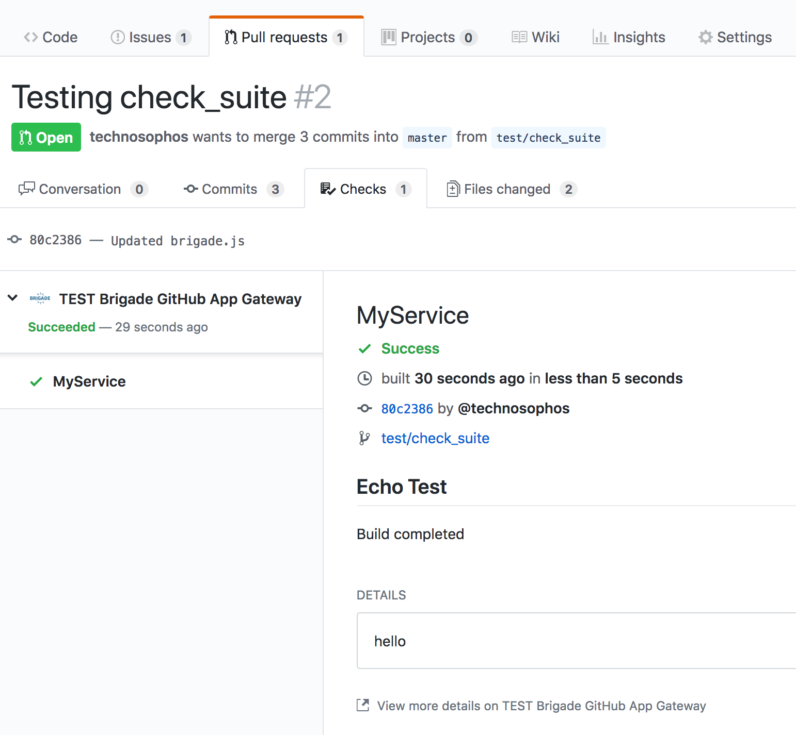

# Brigade Github App: Advanced GitHub Gateway for Brigade

[](https://masterminds.github.io/stability/experimental.html)

**This is considered experimental and pre-Alpha. Do not use it in production.**

This is a [Brigade](https://github.com/Azure/brigade) gateway that provides a
GitHub App with deep integration to GitHub's new Check API.



## Installation

The installation for this gateway is multi-part, and not particularly easy at
the moment.

Prerequisites:

- A Kubernetes cluster running Brigade
- kubectl and Helm
- A local clone of this repository

You will also need to pick out a domain name (referenced as *YOUR_DOMAIN* below)
to send GitHub requests to. Example: `gh-gateway.example.com`. If you don't want
to do this, see the notes in Step 3.

### 1. Create a GitHub App

A GitHub app is a special kind of trusted entity that is associated with either
your account or an orgs account.

https://developer.github.com/apps/building-github-apps/creating-a-github-app/

- Set the _Homepage URL_ to `https://brigade.sh`
- Set the _User Authorization Callback URL_ to **FIXME**
- Set the _Webhook URL_ to `https://YOUR_DOMAIN/events/github`
- Set the _Webhook Secret_ to a randomly generated string. Make note of that string
- Subscribe to the following events:
  - Repository contents: read
  - Issues: read
  - Repository metadata: read
  - Pull requests: read
  - Repository webhooks: read
  - Commit Statuses: Read And Write
  - Checks: Read and Write
- Subscribe to the following webhooks:
  - checks suite
- Choose "Only This Account" to connect to the app.

**Once you have submitted** you will be prompted to create a private key. Create
one and save it locally. You will put this in your `values.yaml` file in the next
step.

### 2. Install the Helm chart into your cluster

The [Brigade Github App Helm Chart][brigade-github-app-chart] is hosted at the
[Azure/brigade-charts][brigade-charts] repository.

You must install this gateway into the same namespace in your cluster where
Brigade is already running.

**Make sure the gateway is accessible on a public IP address**. You can do that
either by setting the Service to be a load balancer, or setting up the Ingress. We
STRONGLY recommend setting up an ingress to use Kube-LEGO or another SSL proxy.

```
$ helm repo add brigade https://azure.github.io/brigade-charts
$ helm inspect values brigade/brigade-github-app > values.yaml
$ # Edit values.yaml
$ helm install -n gh-app brigade/brigade-github-app
```

> The private key you created in Step 1 should be put in your `values.yaml` file:

```yaml
# Other stuff...
github:
  key: |
    YOUR KEY DATA GOES HERE!
    AND EVERY LINE NEEDS TO BE INDENTED
```

On RBAC-enabled clusters, pass `--set rbac.enabled=true` to the `helm install`
command.

### 3. (RECOMMENDED) Create a DNS entry for your app

In the prerequisites section, we suggested that you create a domain. At this point,
you should be able to link that domain to the IP generated by your Service or
Ingress created above.

For example, to map an Ingress IP on our cluster (where we are using the
`kube-lego` chart with the `nginx-ingress` chart), we can run this to get our IP:

```
$ kubectl get svc -n kube-system nginx-nginx-ingress-controller
```

(`helm status` on the appropriate charts will also give you this information)

*NOTE:* If you do not want to use a domain name, go change your GitHub App configuration
to use the IP address directly.


### 4. Test the App from GitHub

Go to the _Advanced_ tab and check out the _Recent Deliveries_ section. This should
show a successful test run. If it is not successful, you will need to troubleshoot
why GitHub could not successfully contact your app.

Likely reasons:

- Your app is not listening on a public IP
- SSL certificate is invalid
- The URL you entered is wrong (Go to the _General_ tab and fix it)
- The Brigade Github App is returning incorrect data

### 5. Install the App

Go to the _Install App_ tab and enable this app for your account.

Accept the permissions it asks for. You can choose between _All repos_ and
_Only select repositories_, and click _Install_

> It is easy to change from All Repos to Only Selected, and vice versa, so we
> recommend starting with one repo, and adding the rest later.

### 6. Add Brigade projects for each GitHub project

For each GitHub project that you enabled the app for, you will now need to
create a Project.

Remember that projects contain secret data, and should be handled with care.

```
$ helm inspect values brigade/brigade-project > values.yaml
$ # Edit values.yaml
```

You will want to make sure to set:

- `project`, `repository`, and `cloneURL`  to point to your repo
- `sharedSecret` to use the shared secret you created when creating the app
- `github.token` (aka `github: {token: }`) to the OAuth token GitHub Apps gave you

## 7. (OPTIONAL): Forwarding `pull_request` to `check_suite`

This gateway can enable a feature that converts PRs to Check Suite requests. Currently, this is enabled by default.

To disable this feature, set the environment variable `CHECK_SUITE_ON_PR=false` on the deployment for the server.
This can also be done by setting `github.checkSuiteOnPR` to `false` in the chart's `values.yaml`.

To forward a pull request (`pull_request`) to a check suite run, you will need to provide the ID for your GitHub Brigade App instance.
(Here also set at the chart-level via `values.yaml`):

```
github:
...
  appID: APP_ID
```

This value is provided after the GitHub App is created on GitHub (see 1. Create a GitHub App). To find this value after creation, visit `https://github.com/settings/apps/your-app-name`.

When these parameters are set, incoming pull requests will also trigger `check_suite:created` events.

## Handling Events in `brigade.js`

This gateway behaves differently than the gateway that ships with Brigade.
Because this is a GitHub App, an authentication token is generated for each
request on-the-fly. And each token is only good for 60 minutes.

The token is generated for you on the gateway, and sent in the payload, which
looks like this:

```json
{
  "token": "some.really.long.string",
  "body": {
    "action": "requested",
    "check_suite": {},
    "...": "..."
  }
}
```

The above shows just the very top level of the object. The object you will
really receive will be much more detailed.

### Events Emitted by this Gateway

This gateway emits the following events:

- `check_suite:requested`: When a new request is opened
- `check_suite:rerequested`: When checks are requested again
- `check_suite:completed`: When a check suite is completed
- `check_run:created`: When an individual test is requested
- `check_run:updated`: When an individual test is updated with new status
- `check_run:rerequested`: When an individual test is re-requested

The `check_suite` events will let you start all of your tests at once, while the
`check_run` events will let you work with individual tests. The example in the
next section shows how to work with suites, while still supporting re-runs of the
main test.

### Running a new set of checks

Currently this gateway forwards all events on to the Brigade.js script, and does
not create new `check_run` requests. The `brigade.js` must create a run, and then
update GitHub as to the status of that run.

Here's an example that starts a new run, does a test, and then marks that
run complete. On error, it marks the run failed.

```javascript
const {events, Job, Group} = require("brigadier");
const checkRunImage = "deis/brigade-github-check-run:latest"

events.on("check_suite:requested", checkRequested)
events.on("check_suite:rerequested", checkRequested)
events.on("check_run:rerequested", checkRequested)

function checkRequested(e, p) {
  console.log("check requested")
  // Common configuration
  const env = {
    CHECK_PAYLOAD: e.payload,
    CHECK_NAME: "MyService",
    CHECK_TITLE: "Echo Test",
  }

  // This will represent our build job. For us, it's just an empty thinger.
  const build = new Job("build", "alpine:3.7", ["sleep 60", "echo hello"])

  // For convenience, we'll create three jobs: one for each GitHub Check
  // stage.
  const start = new Job("start-run", checkRunImage)
  start.imageForcePull = true
  start.env = env
  start.env.CHECK_SUMMARY = "Beginning test run"

  const end = new Job("end-run", checkRunImage)
  end.imageForcePull = true
  end.env = env

  // Now we run the jobs in order:
  // - Notify GitHub of start
  // - Run the test
  // - Notify GitHub of completion
  //
  // On error, we catch the error and notify GitHub of a failure.
  start.run().then(() => {
    return build.run()
  }).then( (result) => {
    end.env.CHECK_CONCLUSION = "success"
    end.env.CHECK_SUMMARY = "Build completed"
    end.env.CHECK_TEXT = result.toString()
    return end.run()
  }).catch( (err) => {
    // In this case, we mark the ending failed.
    end.env.CHECK_CONCLUSION = "failed"
    end.env.CHECK_SUMMARY = "Build failed"
    end.env.CHECK_TEXT = `Error: ${ err }`
    return end.run()
  })
}

```

### Parameters available on the `check-run` container

The following parameters can be specified via environment variables:

- `CHECK_PAYLOAD` (REQUIRED): The contents of `e.payload`.
- `CHECK_NAME` (default: Brigade): The name of the check. You should set this unless
  you are only running a single check.
- `CHECK_TITLE` (default: "running check"): The title that will be displayed on GitHub
- `CHECK_SUMMARY`: A short summary of what the check did.
- `CHECK_TEXT`: A long message explaining the results.
- `CHECK_CONCLUSION`: One of: "succeeded", "failure", "neutral", "canceled", or "timed_out".
  The "action_required" conclusion can be set if CHECK_DETAILS_URL is also set.
- `CHECK_DETAILS_URL`: The URL of an external site that has more information. This
  is typically used with CHECK_CONCLUSION=action_required.
- `CHECK_EXTERNAL_ID`: An ID that correlates this run to another source. For example,
  it could be set to the Brigade build ID.
- `GITHUB_BASE_URL`: The URL for GitHub Enterprise users.
- `GITHUB_UPLOAD_URL`: The upload URL for GitHub Enterprise users.

> Annotations and Image attachments are not currently supported.

You can observe these in action on this screenshot:


## Building From Source

Prerequisites:

- The Go tool chain
- `dep` for Go dependency management
- `make`
- Docker

To build from source:

```console
$ dep ensure         # to install dependencies into vendor/
$ make lint          # to run linters
$ make test          # to run tests
$ make build         # to build local binaries
$ make docker-build  # to build Docker images
```

# Contributing

This project welcomes contributions and suggestions.  Most contributions require you to agree to a
Contributor License Agreement (CLA) declaring that you have the right to, and actually do, grant us
the rights to use your contribution. For details, visit https://cla.microsoft.com.

When you submit a pull request, a CLA-bot will automatically determine whether you need to provide
a CLA and decorate the PR appropriately (e.g., label, comment). Simply follow the instructions
provided by the bot. You will only need to do this once across all repos using our CLA.

This project has adopted the [Microsoft Open Source Code of Conduct](https://opensource.microsoft.com/codeofconduct/).
For more information see the [Code of Conduct FAQ](https://opensource.microsoft.com/codeofconduct/faq/) or
contact [opencode@microsoft.com](mailto:opencode@microsoft.com) with any additional questions or comments.

[brigade-charts]: https://github.com/Azure/brigade-charts
[brigade-github-app-chart]: https://github.com/Azure/brigade-charts/tree/master/charts/brigade-github-app